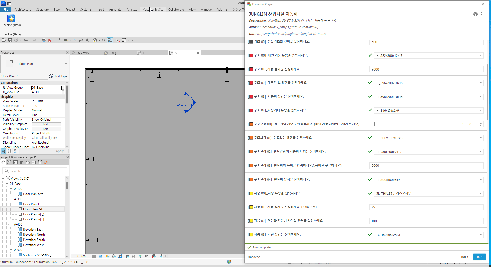
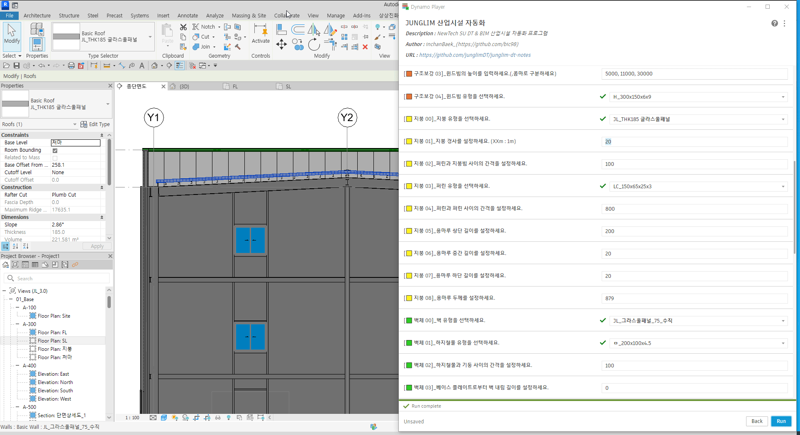
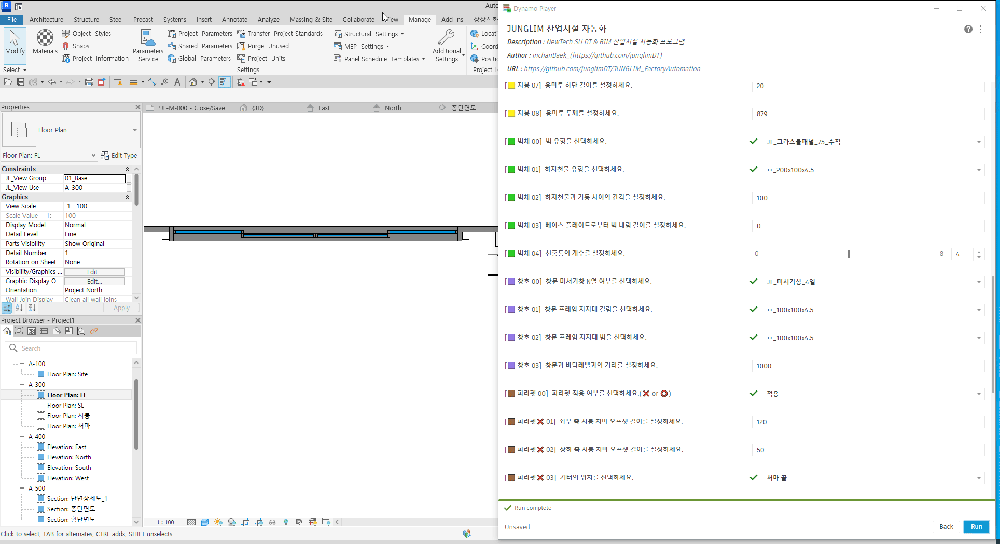

# 정림 산업시설 자동화 프로그램 

### Author by NewTech SU DT/BIM Team

- version 1.0.0 -250617 : 프로그램 개발완료
- version 1.0.1 -250619 : 높이에 따른 그리드 위치가 자동으로 배치되도록 수정하였습니다. 오프닝에 대한 치수와 그리드에 대한 치수를 자동으로 기입할 수 있도록 수정하였습니다. 

X, Y축 그리드를 그리면 해당 그리드에서 공장설계자동화 프로그램이 실행됩니다. 

- X축 그리드는 X1, X2... 처럼 x로 시작해야 하면 이 규칙은 Y축 그리드에도 적용됩니다.
- 레벨 FL, SL, 처마, 지붕의 이름을 고정해야 합니다. 
- 사각형 형태의 공장생성만 가능합니다. 

  

## 사용설명서

안녕하세요 😊
본 프로그램은 정림건축 산업시설 프로젝트의 효율적인 설계를 지원하기 위해 개발된 자동화 도구입니다.
보다 정확하고 신속한 작업을 도와드릴 수 있도록 구성되어 있으니, 아래 설명을 참고하여 순서대로 진행해주시기 바랍니다.

처음 사용하시더라도 어렵지 않도록 최대한 직관적으로 설계하였습니다.
궁금한 점이나 개선이 필요한 부분이 있다면 언제든지 뉴테크 SU 팀에 말씀해 주세요.
여러분의 소중한 피드백이 더 나은 도구로 발전하는 밑거름이 됩니다. ✨

감사합니다!

## 프로그램 개요

- [**기초**](#기초-00--05-사용법)
- [**구조**](#구조-00--04-사용법)
- [**구조 보강**](#구조보강-00--04-사용법)
- [**지붕**](#지붕-00--08-사용법)
- [**벽체**](#벽체-00--04-사용법)
- [**창호**](#창호-00--03-사용법)
- [**파라펫 여부**](#파라펫-미적용-01--05-사용법)
- [**파라펫 적용**](#파라펫-적용-01--06-사용법)

위와 같은 주요 설계 요소를 기준으로 단계별 모델링이 가능하도록 본 프로그램이 구성되어 있습니다.

## 바로가기

### 🔹 기초
- [기초 00 : 바닥 구조 기초(베이스 플레이트)를 선택합니다.](#기초-00--바닥-구조-기초베이스-플레이트를-선택합니다)
- [기초 01 : 베이스 플레이트의 옵션 스타일을 선택합니다.](#기초-01--베이스-플레이트의-옵션-스타일을-선택합니다)
- [기초 02 : 베이스 플레이트 위 상부 콘크리트층을 선택합니다.](#기초-02--베이스-플레이트-위-상부-콘크리트층을-선택합니다)
- [기초 03 : 온통기초 하단 너비를 설정합니다.](#기초-03--온통기초-하단-너비를-설정합니다)
- [기초 04 : 온통기초 각도를 슬라이더로 조절합니다.](#기초-04--온통기초-각도를-슬라이더로-조절합니다)
- [기초 05 : 온통기초의 깊이를 입력합니다.](#기초-05--온통기초의-깊이를-입력합니다)

### 🔹 구조
- [구조 00 : 메인 기둥 유형을 선택하세요.](#구조-00--메인-기둥-유형을-선택하세요)
- [구조 01 : 기둥 높이를 설정하세요.](#구조-01--기둥-높이를-설정하세요)
- [구조 02 : 테두리 보 유형을 선택하세요.](#구조-02--테두리-보-유형을-선택하세요)
- [구조 03 : 지붕거더(큰보) 유형을 선택하세요.](#구조-03--지붕거더(큰보)-유형을-선택하세요)
- [구조 04 : 지붕빔(작은보) 유형을 선택하세요.](#구조-04--지붕빔(작은보)-유형을-선택하세요)

### 🔹 구조보강
- [구조보강 00 : 윈드컬럼 개수를 설정하세요. (메인 기둥 사이에 들어가는 개수)](#구조보강-00--윈드컬럼-개수를-설정하세요-메인-기둥-사이에-들어가는-개수)
- [구조보강 01 : 윈드컬럼 유형을 선택하세요.](#구조보강-01--윈드컬럼-유형을-선택하세요)
- [구조보강 02 : 윈드컬럼의 지붕거더(큰보) 타입을 선택하세요.](#구조보강-02--윈드컬럼의-지붕거더(큰보)-타입을-선택하세요)
- [구조보강 03 : 윈드빔의 높이를 입력하세요. (콤마로 구분하세요)](#구조보강-03--윈드빔의-높이를-입력하세요-콤마로-구분하세요)
- [구조보강 04 : 윈드빔 유형을 선택하세요.](#구조보강-04--윈드빔-유형을-선택하세요)

### 🔹 지붕
- [지붕 00 : 지붕 유형을 선택하세요.](#지붕-00--지붕-유형을-선택하세요)
- [지붕 01 : 지붕 경사를 설정하세요. (XXm : 1m)](#지붕-01--지붕-경사를-설정하세요-xxm--1m)
- [지붕 02 : 퍼린과 지붕빔 사이의 간격을 설정하세요.](#지붕-02--퍼린과-지붕빔-사이의-간격을-설정하세요)
- [지붕 03 : 퍼린 유형을 선택하세요.](#지붕-03--퍼린-유형을-선택하세요)
- [지붕 04 : 퍼린과 퍼린 사이의 간격을 설정하세요.](#지붕-04--퍼린과-퍼린-사이의-간격을-설정하세요)
- [지붕 05 : 용마루 상단 길이를 설정하세요.](#지붕-05--용마루-상단-길이를-설정하세요)
- [지붕 06 : 용마루 중간 길이를 설정하세요.](#지붕-06--용마루-중간-길이를-설정하세요)
- [지붕 07 : 용마루 하단 길이를 설정하세요.](#지붕-07--용마루-하단-길이를-설정하세요)
- [지붕 08 : 용마루 두께를 설정하세요.](#지붕-08--용마루-두께를-설정하세요)

### 🔹 벽체
- [벽체 00 : 벽 유형을 선택하세요.](#벽체-00--벽-유형을-선택하세요)
- [벽체 01 : 하지철물 유형을 선택하세요.](#벽체-01--하지철물-유형을-선택하세요)
- [벽체 02 : 하지철물과 기둥 사이의 간격을 설정하세요.](#벽체-02--하지철물과-기둥-사이의-간격을-설정하세요)
- [벽체 03 : 베이스 플레이트로부터 벽 내림 길이를 설정하세요.](#벽체-03--베이스-플레이트로부터-벽-내림-길이를-설정하세요)
- [벽체 04 : 선홈통의 개수를 설정하세요.](#벽체-04--선홈통의-개수를-설정하세요)

### 🔹 창호
- [창호 00 : 창문 미서기창 N열 여부를 선택하세요.](#창호-00--창문-미서기창-n열-여부를-선택하세요)
- [창호 01 : 창문 프레임 지지대 컬럼을 선택하세요.](#창호-01--창문-프레임-지지대-컬럼을-선택하세요)
- [창호 02 : 창문 프레임 지지대 빔을 선택하세요.](#창호-02--창문-프레임-지지대-빔을-선택하세요)
- [창호 03 : 창문과 바닥레벨과의 거리를 설정하세요.](#창호-03--창문과-바닥레벨과의-거리를-설정하세요)

### 🔹 파라펫 미적용
- [파라펫 01 : 좌우 측 지붕 처마 오프셋 길이를 설정하세요.](#파라펫-01--좌우-측-지붕-처마-오프셋-길이를-설정하세요)
- [파라펫 02 : 상하 측 지붕 처마 오프셋 길이를 설정하세요.](#파라펫-02--상하-측-지붕-처마-오프셋-길이를-설정하세요)
- [파라펫 03 : 거터의 위치를 선택하세요.](#파라펫-03--거터의-위치를-선택하세요)
- [파라펫 04 : 거터의 상하 길이를 설정하세요.](#파라펫-04--거터의-상하-길이를-설정하세요)
- [파라펫 05 : 거터의 좌우 너비를 설정하세요. (최소 55mm 이상)](#파라펫-05--거터의-좌우-너비를-설정하세요-최소-55mm-이상)

### 🔹 파라펫 적용
- [파라펫 01 : 파라펫 높이를 설정하세요.](#파라펫-01--파라펫-높이를-설정하세요)
- [파라펫 02 : 파라펫-Flashing-상단-높이를-설정하세요.](#파라펫-02--파라펫-flashing-상단-높이를-설정하세요)
- [파라펫 03 : 파라펫 Flashing 하단 깊이를 설정하세요.](#파라펫-03--파라펫-flashing-하단-깊이를-설정하세요)
- [파라펫 04 : 파라펫 Flashing 바깥쪽 너비를 설정하세요.](#파라펫-04--파라펫-flashing-바깥쪽-너비를-설정하세요)
- [파라펫 05 : 파라펫 Flashing 안쪽 너비를 설정하세요.](#파라펫-05--파라펫-flashing-안쪽-너비를-설정하세요)
- [파라펫 06 : 상하 측 지붕 처마 오프셋 길이를 설정하세요.](#파라펫-06--상하-측-지붕-처마-오프셋-길이를-설정하세요)

## 기초 00 ~ 05 사용법

  

 

### **기초 00** : 바닥 구조 기초(베이스 플레이트)를 선택합니다.

  

 - JL_매트기초_1000 -> 매트기초(콘크리트 두께 1000을 의미합니다.), 원하는 두께를 설정하면 됩니다. 

  

### **기초 01** : 베이스 플레이트의 옵션 스타일을 선택합니다.  

  

- 벽안까지 : 베이스 플레이트 네 모서리를 벽 안쪽으로 설정합니다. 
- 벽밖까지 : 베이스 플레이트 네 모서리를 벽 바깥으로 설정합니다. 

  

### **기초 02** : 베이스 플레이트 위 상부 콘크리트층을 선택합니다.

드롭다운 옵션에 있는 패밀리 타입을 선택하면 베이스 플레이트 위에 두께만큼 배치됩니다. 

* 상부층에 존재하는 타입의 두께에 따라 SL레벨이 변화됩니다. 

  

### **기초 03** : 온통기초 하단 너비를 설정합니다.  
### **기초 04** : 온통기초 각도를 슬라이더로 조절합니다.  
### **기초 05** : 온통기초의 깊이를 입력합니다.

  

  

> ⚠️ 설정값을 수정하면 기존 생성된 객체는 삭제됩니다.  
> 실행 전에 결과를 저장해주시기 바랍니다.

## 구조  00 ~ 04 사용법

  

### **구조 00** : 메인 기둥 유형을 선택하세요.  

  

구조체 중에 파란색으로 빛이 나는 부분이 메인 기둥입니다. 

  

메인 기둥은 그리드의 교점에 배치됩니다. 그리드의 배치를 변경하면 기둥의 위치도 그리드에 맞게 변경됩니다. 

### **구조 01** : 기둥 높이를 설정하세요.  

  

기둥 높이를 설정합니다. 

> 만약 무근 콘크리트가 120의 두께라면 최종 기둥 높이가 -120 정도 base offset 됩니다. 

### **구조 02** : 테두리 보 유형을 선택하세요.  

  

구조체 중에 파란색으로 빛이 나는 부분이 테두리보 입니다. 메인기둥의 끝점에 위치한 보라고 생각하시면됩니다. 

### 구조 03 : 지붕거더(큰보) 유형을 선택하세요.  

  

구조체 중에 파란색으로 빛이 나는 부분이 지붕빔(보) 입니다. 메인기둥의 끝점에 위치한 경사진 보라고 생각하시며 됩니다. 

### 구조 04 : 지붕빔(작은보) 유형을 선택하세요.  

  

구조체 중에 파란색으로 빛이 나는 부분이 지붕거더 입니다. 지붕빔과 지붕빔을 연결하는 거더입니다. 

## 구조보강 00 ~ 04 사용법

  

> 해당 유형은 옵션입니다. 설정하지 않으셔도 모델링에는 문제가 없습니다. 

### 구조보강 00 : 윈드컬럼 개수를 설정하세요. (메인 기둥 사이에 들어가는 개수)

  

메인기둥을 등분하여 윈드 컬럼이 배치됩니다. 

### 구조보강 01 : 윈드컬럼 유형을 선택하세요.  

  

구조체 중에 파란색으로 빛이 나는 부분이 윈드컬럼 입니다. 메인기둥 사이에 등분되어 배치됩니다. 

### 구조보강 02 : 윈드컬럼의 지붕거더(큰보) 타입을 선택하세요.  

  

구조체 중에 파란색으로 빛이 나는 부분이 윈드컬럼위의 지붕빔입니다. 윈드컬럼의 끝점에 위치한 지붕거더입니다. 

### 구조보강 03 : 윈드빔의 높이를 입력하세요. (콤마로 구분하세요)  

[5000, 11000]이라고 입력하시면 FL +0에서 부터 5000, 11000위치에 윈드빔이 형성됩니다. 만약 기둥높이보다 윈드빔의 높이가 더 높다면 만들어지지 않습니다. 

  

### 구조보강 04 : 윈드빔 유형을 선택하세요.  

  

구조체 중에 파란색으로 빛이 나는 부분이 윈드빔입니다. 테두리보와 별개로 메인기둥의 보입니다. 

## 지붕 00 ~ 08 사용법

  

### 지붕 00 : 지붕 유형을 선택하세요.  

  

### 지붕 01 : 지붕 경사를 설정하세요. (XXm : 1m)  

  

가로로 XXm를 갈 때, 세로로 1m를 가는 경사입니다. 예를 들어 25 : 1이면 tan값이 1 / 25가 되도록 지붕의 경사를 설정합니다. 

> 주의 : 경사가 3 : 1, 5 : 1과 같이 경사가 급하면 지붕의 프로퍼티 중 경사를 재설정해주어야 합니다. 

  

경사가 급하면 레빗자체에서 라디안 값을 인식하지 못하는 버그가 있습니다. 따라서 퍼린의 경사를 참고하여 지붕의 경사를 수동으로 일치시켜 주어야 합니다. 

### 지붕 02 : 퍼린과 지붕빔 사이의 간격을 설정하세요.  

  

퍼린과 지붕 빔사이에 퍼린 고정대를 위한 간격을 마련해두었습니다. 그 간격을 설정하기 위한 용도입니다. 

### 지붕 03 : 퍼린 유형을 선택하세요.  

  

퍼린타입을 설정하시면 지붕경사에 맞게 회전하여 배치됩니다. 퍼린 패밀리를 추가하시면 자동으로 드롭다운에 갱신됩니다. 

### 지붕 04 : 퍼린과 퍼린 사이의 간격을 설정하세요.  

  

퍼린과 퍼린 사이의 간격을 조정할 수 있습니다 

### 지붕 05 : 용마루 상단 길이를 설정하세요.  

### 지붕 06 : 용마루 중간 길이를 설정하세요.  

### 지붕 07 : 용마루 하단 길이를 설정하세요.  

### 지붕 08 : 용마루 두께를 설정하세요.  

  

  

위에서 부터 아래로 용마루의 상단길이, 중간길이, 하단길이 입니다. 여기에 두께를 설정하시면 지붕의 경사에 맞게 용마루가 배치됩니다. 두께와 길이의 최소 길이는 1mm입니다. 

## 벽체 00 ~ 04 사용법

  

### 벽체 00 : 벽 유형을 선택하세요. 

  

그라스울 패널 수평 / 수직을 선택하면 외벽의 해치 방향과 벽 두께가 결정됩니다. (수직 해치, 수평 해치)

### 벽체 01 : 하지철물 유형을 선택하세요. 

그라스울 패널을 지지하고 파라펫 유형일 경우 하지 철물이 파라펫 높이까지 연장됩니다. 

  

### 벽체 02 : 하지철물과 기둥 사이의 간격을 설정하세요. 

하지철물과 기둥사이에 간격을 두어 가변적인 고정대에 대응하기 위한 간격입니다. 

  

### 벽체 03 : 베이스 플레이트로부터 벽 내림 길이를 설정하세요.

  

### 벽체 04 : 선홈통의 개수를 설정하세요. 

선홈통의 개수를 설정하면 상하쪽 사이드에 설정한 개수 만큼 생깁니다. 만약에 2를 선택하시면 최종 모델링에는 사이드 당 2씩 총 네개가 생깁니다. 

또한 선홈통의 위치는 등간격으로 창문사이에 자동으로 배치됩니다. 필요한 위치에 사용자가 직접 이동시켜야 합니다. 

  

## 창호 00 ~ 03 사용법

모든 창호는 윈드빔과 바닥레벨을 기준으로 형성됩니다. 

  

### 창호 00 : 창문 미서기창 N열 여부를 선택하세요.  

  

### 창호 01 : 창문 프레임 지지대 컬럼을 선택하세요.  

창문 프레임을 고정해주는 좌우쪽 지지대입니다. 

  

  

### 창호 02 : 창문 프레임 지지대 빔을 선택하세요.  

  

창문 프레임을 고정해주는 상하쪽 지지대입니다. 

  

### 창호 03 : 창문과 바닥레벨과의 거리를 설정하세요.  

윈드빔과 바닥레벨로 부터 창이 시작하는 위치를 설정합니다. 

  

## 파라펫 미적용 01 ~ 05 사용법

  

### 파라펫 01 : 좌우 측 지붕 처마 오프셋 길이를 설정하세요.  

  

### 파라펫 02 : 상하 측 지붕 처마 오프셋 길이를 설정하세요.  

  

### 파라펫 03 : 거터의 위치를 선택하세요.  

  

### 파라펫 04 : 거터의 상하 길이를 설정하세요.  

  

### 파라펫 05 : 거터의 좌우 너비를 설정하세요. (최소 55mm 이상)  

  

## 파라펫 적용 01 ~ 06 사용법

  

### 파라펫 01 : 파라펫 높이를 설정하세요.  

  

### 파라펫 02 : 파라펫 Flashing 상단 높이를 설정하세요.  

  

  

### 파라펫 03 : 파라펫 Flashing 하단 깊이를 설정하세요.  

  

### 파라펫 04 : 파라펫 Flashing 바깥쪽 너비를 설정하세요.  

  

### 파라펫 05 : 파라펫 Flashing 안쪽 너비를 설정하세요.  

  

### 파라펫 06 : 상하 측 지붕 처마 오프셋 길이를 설정하세요.

  

